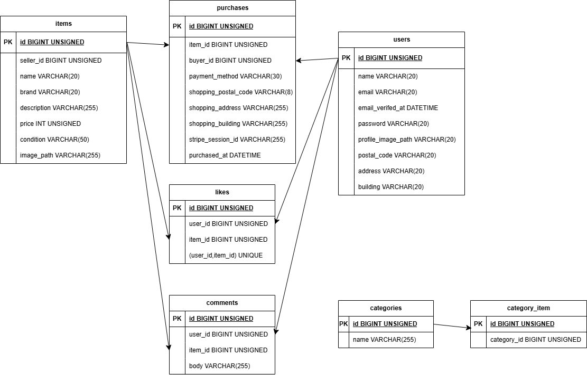

# アプリケーション名

フリマアプリ（模擬案件）

## 環境構築

-   Docker のビルドからマイグレーション、シーディングまでを記述する

### Docker ビルド

-   git clone https://github.com/takuya0521/fleamarket?tab=readme-ov-file
-   docker compose up -d --build

### Laravel 環境構築

-   docker compose exec laravel.test bash
-   composer install
-   cp .env.example .env
-   php artisan key:generate
-   php artisan migrate
-   php artisan db:seed

### フロント（Vite / Tailwind）

-   npm install
-   npm run dev

※ `WWWGROUP` / `WWWUSER` が未設定という WARNING が表示される場合がありますが、動作に問題がない場合はそのまま進めてください。

## 開発環境

-   アプリ画面：http://localhost:8080/
-   フロント開発サーバ（Vite）：http://localhost:5174/

## 使用技術（実行環境）

-   PHP 8.5.0
-   Laravel 12.42.0
-   MySQL 8.4.7
-   Docker / Docker Compose
-   Node.js / npm（Vite / Tailwind 利用のため必須）

## ER 図

-   

---

## トラブルシューティング（注意点）

### create-testing-database.sh が原因で MySQL 初期化に失敗する場合

-   mysql サービスで `create-testing-database.sh` を `/docker-entrypoint-initdb.d/` にマウントしています。
-   マウント元のファイルが存在しない状態で起動すると、Docker 側でパスがディレクトリ扱いになることがあり、MySQL 初期化でエラーになる場合があります。

#### 確認

-   下記で `create-testing-database.sh` がファイルとして存在することを確認してください。
    -   ls -l ./vendor/laravel/sail/database/mysql/create-testing-database.sh

#### 対処（必要な場合）

-   既に DB ボリュームが作成済みだと初期化スクリプトが再実行されないため、ボリューム削除後に再起動します。
    -   docker compose down -v
    -   docker compose up -d --build
