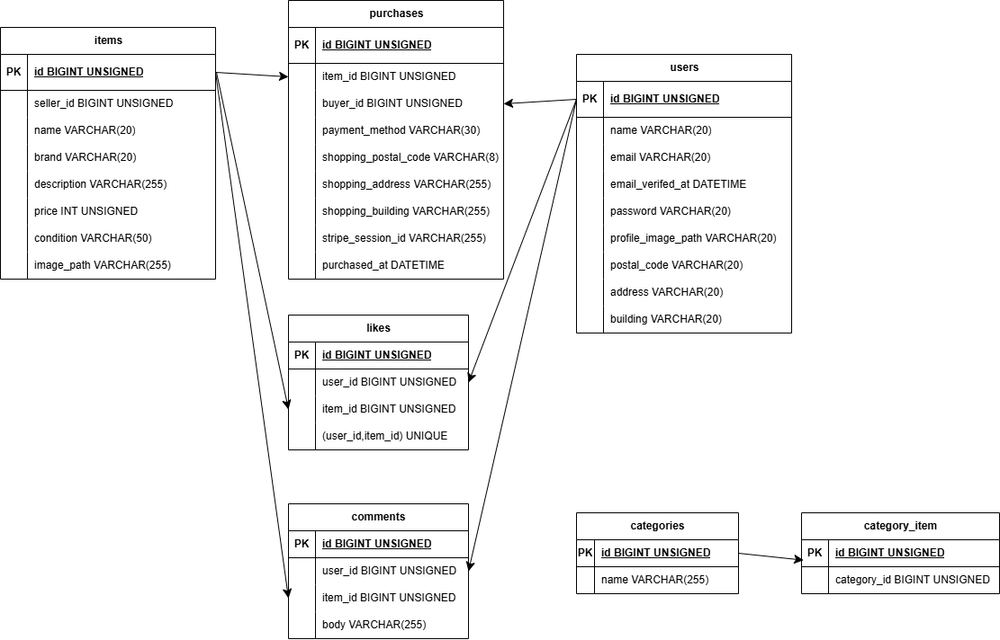

# アプリケーション名

フリマアプリ（模擬案件）

## 概要

Laravel / Docker / MySQL / Vite を用いて作成したフリマアプリです。
会員登録、ログイン、商品一覧、商品詳細、いいね、コメント、購入、プロフィール編集、出品、取引機能などを実装しています。

---

## 環境構築

### 1. リポジトリを clone

```bash
git clone https://github.com/takuya0521/fleamarket.git
cd fleamarket
```

### 2. `.env` ファイルを作成

```bash
cp .env.example .env
```

### 3. Docker コンテナを起動

```bash
docker compose up -d --build
```

### 4. Laravel 環境構築

```bash
docker compose exec laravel.test composer install
docker compose exec laravel.test php artisan key:generate
docker compose exec laravel.test php artisan migrate:fresh --seed
docker compose exec laravel.test php artisan storage:link
```

### 5. フロントエンド環境構築

```bash
docker compose exec laravel.test npm install
docker compose exec laravel.test npm run build
```

---

## 開発環境

- アプリ画面  
  http://localhost:8080/

- Mailpit  
  http://localhost:8025/

---

## 使用技術（実行環境）

- PHP 8.5.0
- Laravel 12
- MySQL 8.4
- Docker / Docker Compose
- Node.js / npm
- Vite / Tailwind CSS

---

## 主な機能

- 会員登録
- ログイン / ログアウト
- メール認証
- 商品一覧表示
- 商品詳細表示
- 商品検索
- いいね機能
- コメント機能
- 購入機能
- 配送先住所変更
- マイページ表示
- 出品機能
- 取引チャット機能
- 取引完了 / 評価機能

---

## 取引機能の確認手順

### 取引画面の確認方法

1. 購入可能な商品を出品者とは別ユーザーで購入します。
2. 購入後、マイページまたは取引一覧画面から対象取引を開きます。
3. 取引詳細画面でメッセージ送信ができます。
4. 購入者側で取引完了を行うと、出品者側で評価操作が可能になります。

### 確認できる内容

- 取引一覧表示
- 取引詳細表示
- メッセージ送信
- 未読既読管理
- 購入者の取引完了
- 出品者の評価
- 完了通知メール送信

---

## フロント開発サーバを利用する場合

開発時に Vite の開発サーバを利用する場合は、以下を実行してください。

```bash
docker compose exec laravel.test npm run dev
```

Vite 開発サーバ:
http://localhost:5174/

---

## ER図



---

## トラブルシューティング

### `docker compose up -d --build` 実行時に build エラーになる場合

本アプリでは、Sail の runtime を `vendor/laravel/sail` ではなく、プロジェクト配下の `docker/` ディレクトリから参照する構成にしています。  
そのため、`compose.yaml` では以下のパスを利用しています。

- `./docker/8.5`
- `./docker/mysql/create-testing-database.sh`

`docker/` ディレクトリが存在しない場合は、ファイルが正しく取得できていない可能性があるため、リポジトリを再取得してください。

---

### `WWWGROUP` / `WWWUSER` の WARNING が表示される場合

環境によっては、`WWWGROUP` / `WWWUSER` 未設定の WARNING が表示される場合があります。  
その場合は `.env` に以下を追記してください。

```env
WWWUSER=1000
WWWGROUP=1000
APP_PORT=8080
VITE_PORT=5174
FORWARD_DB_PORT=3307
```

設定後、以下を再実行してください。

```bash
docker compose down -v
docker compose up -d --build
```

---

### MySQL 初期化に失敗する場合

既に DB ボリュームが作成済みだと、初期化スクリプトが再実行されないことがあります。  
その場合は、ボリューム削除後に再起動してください。

```bash
docker compose down -v
docker compose up -d --build
```

---

### マイグレーションやシーディングで失敗する場合

コンテナ起動後に、以下を順番に再実行してください。

```bash
docker compose exec laravel.test composer install
docker compose exec laravel.test php artisan migrate:fresh --seed
```

---

## 補足

初回起動時は、Docker イメージの build や npm パッケージの install に少し時間がかかる場合があります。
